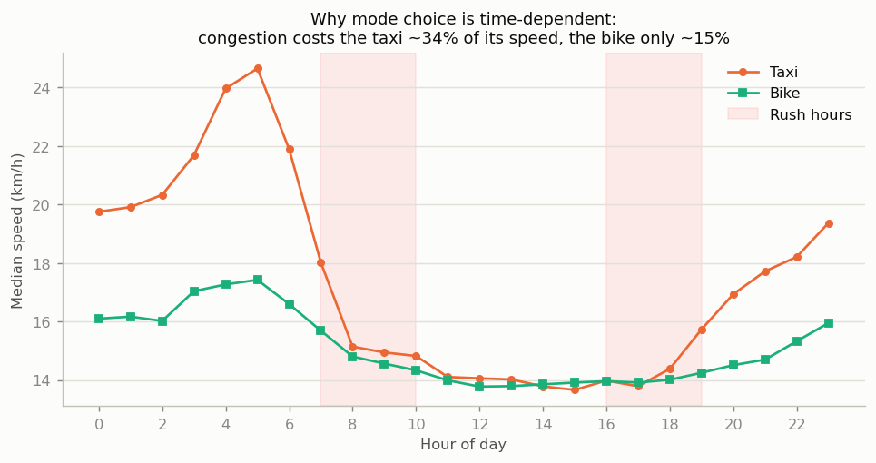
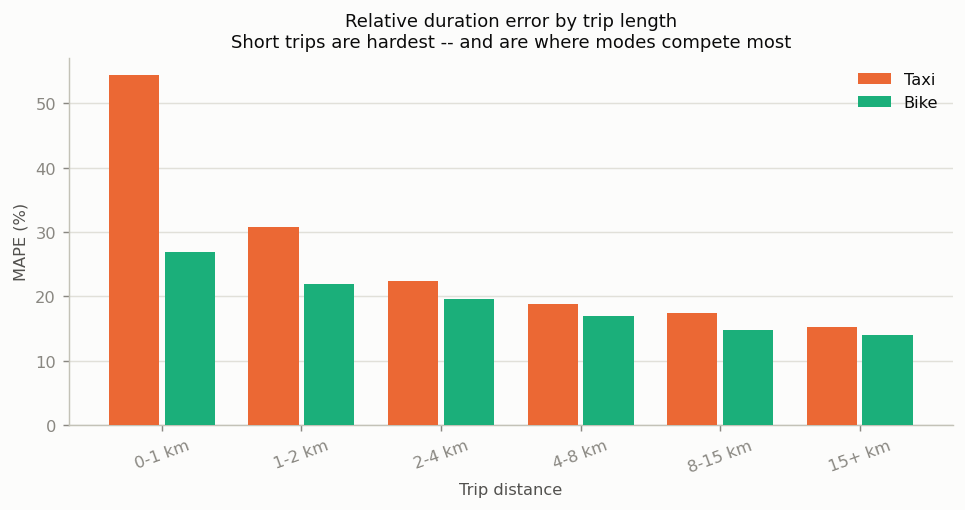
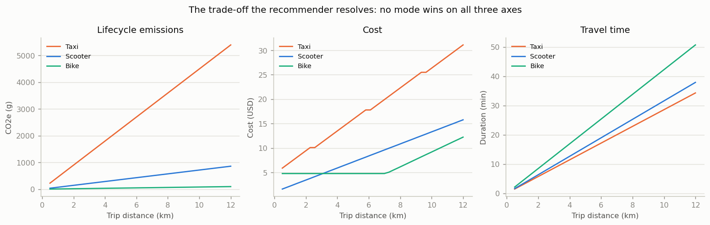

# Sustainable Ride Suggestion

A predictive recommender that estimates **travel time, cost and lifecycle CO₂** for taxi, bike and e-scooter trips in New York City, then ranks them against a traveller's own trade-off between money, time and carbon.

Built on real public data — **2.96 million NYC TLC yellow-cab trip records** and **1.89 million Citi Bike rides** from January 2024.

```
  mode                       time      cost        CO₂     dist   score
  ------------------------------------------------------------------------
 * E-Scooter                   31m    11.97$       488g    6.83km   0.109  [frontier]
   Citi Bike (classic)         42m     7.39$        55g    6.83km   0.300  [frontier]
   Yellow Taxi                 31m    34.83$      3407g    7.58km   0.700  [frontier]

  E-Scooter is the best match for your priorities: 31 min door-to-door, $11.97,
  488 g CO2e. That is 2918 g less CO2e than taking a taxi -- about 48.6 days of a
  mature tree's CO2 absorption. You also save $22.86. Citi Bike (classic), Yellow
  Taxi are also defensible -- no option beats them on every measure at once, so this
  ranking reflects your stated weights, not a universal answer.
```

---

## Results

All figures are held-out test metrics on real data (80,000 test rows per model).

| Model | Target | MAE | RMSE | R² | MAPE |
|---|---|---:|---:|---:|---:|
| `taxi_duration` | trip duration (min) | **2.98 min** | 4.39 | 0.762 | 24.3% |
| `taxi_fare` | metered fare (USD) | **$2.32** | 3.44 | 0.917 | 15.4% |
| `bike_duration` | trip duration (min) | **2.18 min** | 4.37 | 0.716 | 21.6% |

Estimator: `HistGradientBoostingRegressor`, trained on `log1p(duration)` because trip durations are strongly right-skewed. Zone IDs are handled as native unordered categoricals rather than one-hot expanded into 526 sparse columns.

### Data cleaning was not cosmetic

| Dataset | Raw rows | After cleaning | Retained |
|---|---:|---:|---:|
| NYC TLC yellow taxi | 2,964,624 | 2,262,307 | 76.3% |
| Citi Bike | 1,888,085 | 1,809,482 | 95.8% |

The taxi data contains refunds recorded as negative fares, dropoffs timestamped before pickups, and zero-passenger trips. Every filter is counted and written to [`reports/data_quality.json`](reports/data_quality.json) — the cleaning is auditable, not a black box.

---

## What the analysis actually found

### 1. Congestion is why mode choice depends on the clock



Taxi speed falls from **22.0 km/h overnight to 14.4 km/h at peak — a 34% loss**. A bike loses only 15% over the same window. The taxi gives up **2.3× as much speed to congestion** as the bike.

At 3 a.m. the taxi wins on time comfortably. At 6 p.m. that advantage nearly vanishes — and once the bike is also cheaper and cleaner, the recommendation flips on time of day alone. This is why hour-of-day and day-of-week are core model features, cyclically encoded so that 23:00 and 00:00 are adjacent rather than maximally distant.

### 2. Short trips are the hardest to predict — and the ones that matter



Duration MAPE rises from ~15% on long trips to **54% on sub-kilometre trips**. That is the opposite of convenient: **76% of taxi trips are under 5 km**, exactly the range where a bike or scooter is a genuine alternative and where the recommender has to be right.

Reporting only the headline R² of 0.762 would have hidden this entirely.

### 3. A fair fight between the learned model and the rate card

The taxi fare can be estimated two ways: learned from 400k observed fares, or reconstructed from the published TLC tariff. Comparing them exposed a methodology trap worth being explicit about.

| Estimator | MAE | MAPE | Deployable? |
|---|---:|---:|---|
| Learned gradient boosting | **$2.31** | 15.4% | ✅ yes |
| Tariff + *predicted* duration | $2.47 | 16.7% | ✅ yes |
| Tariff + *actual* duration | $1.64 | 10.3% | ❌ **no — uses the answer** |

The third row looks like the winner and is not a competitor at all: it is fed the realised trip duration, which is unknowable at prediction time. Scored fairly, the learned model wins.

The **$0.83 gap** between the oracle and predicted tariff rows is the interesting number: it isolates fare error caused purely by *duration* error propagating through the rate card. The rate card itself is nearly exact — almost all remaining fare uncertainty is really traffic uncertainty.

### 4. No mode wins on all three axes



The cost curves genuinely cross. A scooter is the cheapest option for short hops, but **beyond about 2.6 km it becomes more expensive than a bike**, because scooter pricing is purely per-minute while Citi Bike's single ride includes the first 30 minutes for a flat unlock fee. The "cheap" option stops being the cheap option — and it does so well inside the range where both are viable.

(A scooter stays cheaper than a *taxi* across the whole plausible range; the meaningful cost decision is scooter vs bike.) The carbon gap, by contrast, is enormous and roughly constant in ratio.

This is why the engine reports a **Pareto frontier** before applying any weighted score — see below.

---

## Design decisions worth defending

### Lifecycle emissions, not tailpipe

A shared e-scooter has no tailpipe. On an **operational** basis it looks **27× cleaner** than a taxi, and comparisons drawn that way flatter light electric vehicles enormously. Counting manufacturing amortised over a short service life, plus the vans that collect and redistribute the fleet, that advantage falls to **6.3×** on a **lifecycle** basis.

Still a large win for the scooter — but a *different* claim, and the honest one. The choice of accounting basis moves the headline number by more than a factor of four, which is why it is a configured, documented parameter rather than a silent default.

Taxi emissions also include a **1.45× deadhead multiplier** — a cab's revenue kilometre is not its only kilometre, and mode comparisons that ignore cruising-for-fares systematically favour taxis.

Every factor is sourced in [`config/emissions.yaml`](config/emissions.yaml) (EPA, ICCT, Hollingsworth et al. 2019, ITF 2020) and served over the API at `/emissions/factors`. A carbon figure that cannot be traced to a citation is not one anybody should rely on.

### Pareto frontier before weighted scoring

A weighted score alone is an unsatisfying answer, because the weights are invented. Someone who says they weight cost, time and carbon equally has not really specified a utility function, and small changes to arbitrary weights can flip the ranking.

Pareto dominance is **weight-free**. An option is dominated when another is at least as good on every objective and strictly better on one — meaning no rational traveller would ever pick it, whatever their preferences. That is a far stronger claim than "it scored lower."

So the engine reports both: the frontier (defensible, preference-independent) and the weighted ranking within it (useful, and clearly labelled as preference-based).

### Door-to-door time, not vehicle time

The models predict how long the *vehicle* moves. That is not what a traveller experiences. Hailing a cab, walking to a dock, and finding somewhere to leave a scooter are real minutes that differ sharply by mode — so comparing raw vehicle times would systematically favour whichever mode has the worst access overhead.

### There is deliberately no scooter model

No open dataset of shared e-scooter trips exists at anything like this scale. Rather than invent one, the scooter estimate is **derived** from the e-bike model using a speed factor calibrated from the observed electric-vs-classic Citi Bike speed ratio (1.37×), with a documented adjustment for a governed 15 mph top speed.

The API returns this with `confidence: "low"` and a source string saying exactly where the number comes from. *"We do not have this data"* is a better answer than a confident fabrication.

### Live routing that degrades instead of failing

OpenRouteService supplies real road geometry when an `ORS_API_KEY` is present. When the key is missing, the quota is spent, or the network is down, the router falls back to straight-line distance scaled by a fitted circuity factor — and flags every such response with `route_is_estimate: true`.

The failure is *latched*: once the primary fails, it is not retried on every subsequent request, which would add latency to every request.

### Circuity measured, not assumed

Circuity — road distance ÷ straight-line distance — is usually quoted as a literature constant. The TLC data lets us measure it instead: the meter records the distance actually driven. The fitted median is **1.296**, and the honest reading is that this is *circuity conditional on zone-centroid endpoints*, which is precisely the quantity this pipeline needs. It would be the wrong number to quote as "NYC circuity" in general. ([details in the notebook](notebooks/01_exploratory_analysis.ipynb))

---

## Quick start

```bash
git clone <your-repo-url>
cd Sustainable_ride_Suggestion

python -m venv .venv
source .venv/Scripts/activate      # Windows: .venv\Scripts\activate
pip install -r requirements.txt
```

**Full pipeline on real data** (downloads ~420 MB, takes ~10 min):

```bash
python -m sustainable_ride.cli pipeline
```

**No download?** The synthetic generator runs the identical pipeline in about a minute:

```bash
python -m sustainable_ride.cli pipeline --synthetic
```

Then:

```bash
streamlit run app/streamlit_app.py           # interactive demo
python -m sustainable_ride.cli serve         # API on :8000, docs at /docs
python -m pytest                             # 177 tests
```

### One-off recommendation

```bash
python -m sustainable_ride.cli recommend \
    --origin-lat 40.7580 --origin-lon -73.9855 \
    --dest-lat 40.7061 --dest-lon -73.9969 \
    --departure 2024-01-15T17:30 \
    --w-cost 0.2 --w-time 0.3 --w-co2 0.5
```

### API

```bash
curl -X POST http://127.0.0.1:8000/recommend \
  -H 'Content-Type: application/json' \
  -d '{"origin":{"lat":40.7580,"lon":-73.9855},
       "destination":{"lat":40.7061,"lon":-73.9969},
       "departure":"2024-01-15T17:30:00",
       "weights":{"cost":0.2,"time":0.3,"co2":0.5}}'
```

| Route | Purpose |
|---|---|
| `POST /recommend` | Rank modes for a trip |
| `GET /models` | Model cards with held-out metrics |
| `GET /emissions/factors` | Emission factors with citations |
| `GET /health` | Liveness and readiness |

### Optional: real road routing

```bash
cp .env.example .env
# add your free key from https://openrouteservice.org/dev/#/signup
```

Everything works without it — responses are simply flagged as estimates.

---

## Project layout

```
src/sustainable_ride/
├── config.py            # YAML-backed configuration
├── cli.py               # download / prepare / train / evaluate / serve
├── viz.py               # shared, CVD-validated colour palette
├── data/                # acquisition, cleaning, synthetic fallback
├── features/            # geo primitives + shared train/serve feature builders
├── routing/             # OpenRouteService client + analytic fallback
├── emissions/           # sourced CO₂ factors, deadheading, occupancy
├── pricing/             # NYC taxi tariff, Citi Bike & scooter rate cards
├── models/              # training, registry, evaluation
├── recommender/         # Pareto frontier + weighted scoring engine
└── api/                 # FastAPI service
app/streamlit_app.py     # interactive demo
notebooks/               # executed EDA with outputs
config/                  # all tunables: emission factors, tariffs, thresholds
tests/                   # 177 tests
```

### Training and serving share one feature path

`features/build.py` is called by both the training pipeline and the live API. Feature skew — where training computes a feature one way and serving another — is silent, since nothing crashes and the model just quietly gets worse. `TestTrainInferenceParity` asserts the two produce identical output for identical input.

---

## Honest limitations

- **Zone-centroid quantisation is the binding accuracy constraint on taxi models.** Since 2017 the TLC publishes pickup/dropoff *zones*, not coordinates, for privacy. Collapsing each of 263 zones to a centroid injects several hundred metres of error into every taxi trip. Citi Bike publishes true station coordinates, which is why the bike model works from exact positions.
- **Scooter figures are derived, not learned** (see above), and scooter *pricing* is the least certain number in the project — operators do not publish rate cards.
- **Weather is a user-supplied parameter, not a data source.** No historical weather was joined to the trips, so the model has not learned rain effects; rain only enters as a feasibility filter.
- **Congestion-zone detection is a bounding box**, not the true sub-96th-Street Manhattan boundary.
- **One month of data (January 2024).** Winter in NYC suppresses cycling and depresses micromobility mode share; a summer month would shift the balance toward bikes.
- **Synthetic-mode metrics are circular and should not be quoted.** Models trained on generated data score *higher* (R² 0.833 / 0.952 / 0.858) than on real data, because they are recovering structure deliberately written into the generator. That gap is the clearest possible demonstration of why the real-data numbers are the ones that count.

---

## Data sources

- [NYC TLC Trip Record Data](https://www.nyc.gov/site/tlc/about/tlc-trip-record-data.page) — yellow taxi records, zone lookup and shapefile
- [Citi Bike System Data](https://citibikenyc.com/system-data) — ride records with station coordinates
- Emission factors: US EPA, ICCT (2021), Hollingsworth et al. (2019) *Environ. Res. Lett.* 14(8), ITF (2020)

Tech: Python · scikit-learn · pandas · NumPy · FastAPI · Streamlit · pytest

## License

MIT
